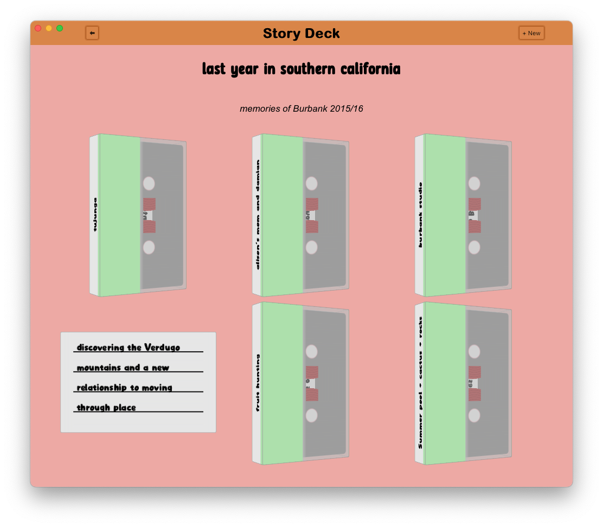
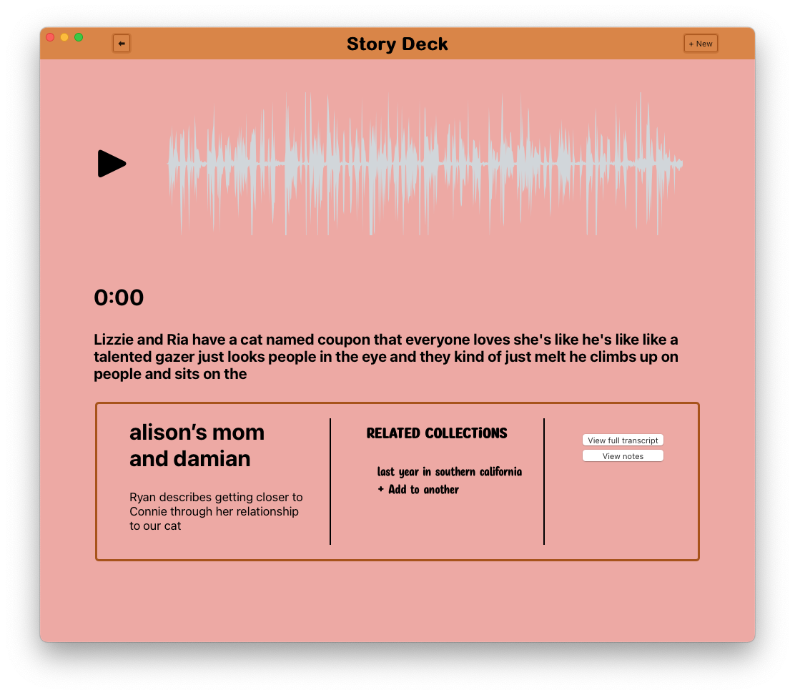

# Story Deck

*Story Deck* is a cross-platform desktop application that allows a user to annotate audio recordings and organize them into story collections, primarily for use in personal oral history projects. 

 

Recordings brought into the app are transcribed on-device using the Picovoice Leopard speech-to-text engine and presented to the user for annotation. Work is ongoing to add the ability to tag recordings in various ways with people, locations and custom information types, as well as to make the recordings, collections and transcripts searchable.

*Story Deck* was developed as a capstone project for [Ada Developers Academy](adadevelopersacademy.org) C17 💜 to learn about building apps using Tauri, Rust and React.

## Setup

Currently the prototype connects to a [MongoDB Atlas](mongodb.com) database instance and the build process expects a connection string to be set in the environment variable `MONGODB_URI`. The build process also tries to read a `PV_KEY` environment variable for a [Picovoice](picovoice.ai) API key.

Once an account with both services has been set up and those values have been set in the environment, the prototype can be built by cloning this repository and running `yarn tauri dev` in the project directory to compile the development build.

